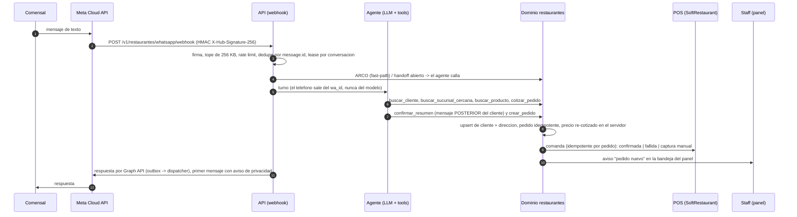
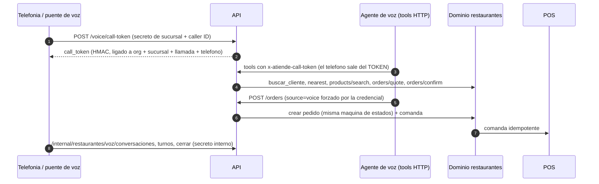

# Ciclo de punta a punta de Restaurantes, por rol (R-34)

Qué ocurre, paso a paso y con qué código, desde que un comensal escribe, llama o entra al sitio hasta que el pedido
queda entregado y cerrado. Cada flujo lo ejecuta de verdad el banco e2e (`apps/api/tests/e2e-ciclo/`, ver
[Cómo se verifica](#como-se-verifica)); lo que NO es real hoy está en [Qué es simulado y qué falta](#que-es-simulado-y-que-falta).

Reglas duras que el servidor aplica en los tres canales (no dependen del prompt): pedido mínimo a domicilio de
$200, alcohol sin domicilio, horario de la sucursal (12:00-01:00 en la cuenta de PM), cobertura de reparto por
zona, "3 de bistec" cotizado como orden de 3, promociones automáticas por día y canal (2x1 del lunes solo para
recoger) y la máquina de estados cotizar -> confirmar -> crear (`agent-tools/order-flow.ts`).

## 1. Comensal por WhatsApp



- **Cliente nuevo**: no existe fila en `restaurantes.customers` hasta el primer pedido; `upsertCustomer` lo crea con
  nombre y teléfono normalizado (10 dígitos) y `addCustomerAddressIfNew` guarda la dirección. El **aviso de
  privacidad y "asistente virtual"** se antepone al primer mensaje de cada teléfono (`claimPrivacyNotice`); los
  derechos ARCO ("mis datos personales") los atiende un fast-path determinista antes del LLM.
- **Cliente existente**: `buscar_cliente` devuelve nombre, direcciones, último pedido y "lo de siempre"; una
  segunda dirección igual no se duplica.
- **Handoff**: cancelaciones, cobros, alergias, quejas, "quiero una persona" y pedidos grandes (más de $4,000 o más de 5 kg;
  más de $2,500 si el número no tiene historial y paga en efectivo: decisión del 2-oct, `PM_PEDIDO_GRANDE_POR_OMISION` en
  `perfil-pm.ts`, editable por organización; regla del prompt de PM) abren una toma de handoff y el agente deja de contestar (`handoffGate`).
- **Replay / carrera**: Meta entrega al menos una vez; el mismo `message.id` no genera segundo turno ni segunda
  respuesta. Un payload solo de estados se acusa 200 sin turno.

- **Nota de voz (R-32)**: un mensaje `audio` se descarga de Meta (`GET /{media-id}` y luego la URL firmada, ambas con el
  token), se transcribe con el rol `restaurantes:transcripcion` del gateway LLM (modelos con entrada de audio y proveedor
  de EE.UU., ver `docs/LLM-GATEWAY.md`) y el agente recibe el texto marcado `[Nota de voz transcrita] ...`. La
  transcripción es un mensaje más: **no salta cotizar ni confirmar** (el pedido solo se crea con la confirmación en un
  mensaje posterior) y pasa por la redacción de datos de pago. Topes: 90 s y 3 MiB por nota, 5 notas por conversación y
  hora, 300 por organización y día, más el interruptor de plataforma `restaurantes:transcripcion` y el presupuesto
  mensual de la organización. El replay de Meta (mismo `message.id`) no se transcribe dos veces: la transcripción corre
  después de reclamar el mensaje en el ledger. **Sin `WHATSAPP_ACCESS_TOKEN`, sin gateway LLM, sin modelo que acepte
  audio, con un tope alcanzado o ante cualquier error se conserva el comportamiento anterior** (el agente le pide al
  cliente que escriba) y el motivo queda en un log sin PII (`nota_de_voz_sin_transcribir`: nunca la URL firmada, el id
  de media, el audio ni el teléfono). Formatos aceptados: ogg/opus, mp3, m4a y aac (amr se rechaza). En producción
  requiere el token de WhatsApp Cloud API (R-25); mientras no exista, el estado es el de antes.

## 2. Comensal por llamada (voz)



- El `customer_phone` que escriba el modelo se **ignora**: manda el caller ID del token. Con token, el historial
  solo es el del número que llama.
- La transcripción se redacta (tarjeta/CVV) antes de persistir y el teléfono se guarda solo como hash.
- El proveedor real de voz (Gemini Live) no corre en este repo: el banco usa un guion que invoca las mismas rutas.

## 3. Comensal en el sitio (eliminado)

La tienda pública de pedidos en línea (`/pedir/*`) y el checkout web ya no existen: los pedidos entran por WhatsApp o por llamada. Los pedidos históricos con canal `web` siguen en la base y se muestran como «Pedido en línea (histórico)».

## 4. Cocina

1. El pedido aparece en `GET /v1/restaurantes/:propertyId/admin/orders?status=pending` y la comanda ya está en el
   POS (o en la bandeja de comandas: `.../admin/softrestaurant/comandas`).
2. Si el POS estaba caído, la comanda queda `fallida`/`captura_manual`: el gerente la captura a mano en el POS y la
   marca (`POST .../comandas/:id/capturada`). El dispatcher interno (`/internal/restaurantes/softrestaurant-dispatch`,
   cada 5 min) reintenta las pendientes y no reenvía las capturadas.
3. `PATCH .../admin/orders/:id/status` (máquina en `order-lifecycle.ts`): `pending -> preparando -> en_camino -> entregado -> completado` a
   domicilio, y `preparando -> listo_para_recoger -> entregado|no_recogido` para recoger (un pedido para recoger no sale `en_camino` y un pedido a
   domicilio no pasa a `listo_para_recoger`; ambos casos responden 409). `cancelado` es posible desde `programado`, `pending`, `preparando`, `listo_para_recoger` y `no_recogido`, pero no desde `en_camino` ni `entregado`, `problema` desde cualquier estado
   activo, y `cancelado` y `completado` son terminales. Un salto inválido (p. ej. `pending -> entregado`) o repetir el mismo estado responde 409 y
   no cambia nada. Avisan al comensal por WhatsApp (outbox + dispatcher) **solo** `preparando`, `en_camino`, `listo_para_recoger`, `entregado` y
   `cancelado`, una vez por estado; `completado`, `problema` y `no_recogido` no mandan aviso al comensal.
3. bis. **Cancelar antes de que la comanda llegue al POS**: si el POS estaba lento o caído, la comanda queda `pendiente`/`fallida` (o `captura_manual`) en el outbox. Al
   cancelar el pedido el servidor la corta (`cortarComandaDePedidoCancelado`: pasa a `capturada_manual` con la nota "Pedido cancelado antes de llegar al
   POS", sin migración) para que el despachador no la mande a cocina cuando el POS vuelva. Una comanda ya `confirmada` en el POS, o en vuelo
   (`enviada`) en ese instante, **no** se retira: el puerto del POS no expone cancelar, así que cocina debe avisarse por el POS. Caso conocido: una comanda
   `enviada` al cancelar que luego falla por timeout vuelve a `fallida` y el despachador puede reintentarla (el despachador no revisa el estado del pedido).
4. **Pedido programado** (`POST /v1/restaurantes/:orgSlug/orders` con credenciales de voz **o agente** de WhatsApp/voz con `programado_para`): queda en `programado` y no va a cocina ni al POS; al faltar 30 min lo promueve el cron
   (`/internal/restaurantes/promover-programados`, 5 min) o el panel al consultar, y en ese momento su comanda se encola al POS
   **con su propina y canal**, y el staff recibe el aviso en la bandeja (`order.programado_promovido`) y en la campana
   (`restaurantes.pedido.programado_en_cocina`). Una sucursal desactivada NO promueve sus programados (migración interna 042
   `promover_programados_solo_sucursal_activa` y filtro en el panel): se quedan en `programado`, visibles en la lista de programados, para que el equipo los atienda.

## 5. Repartidor

`GET /v1/restaurantes/:propertyId/repartidor/orders` solo lista sus pedidos asignados;
`PATCH .../repartidor/orders/:id/status` solo permite `en_camino`, `entregado` y `problema` (con nota). Un pedido
ajeno responde 404 uniforme. `en_camino` y `entregado` avisan al comensal; `problema` avisa al staff.

## 6. Gerente

- **Bandeja de notificaciones** (`.../admin/order-notifications`, reconocer con `.../:id/acknowledge`): pedido
  nuevo, repartidor asignado, incidencia y pedido programado que entró a cocina. Es la bandeja propia de restaurantes; la campana
  (`core.notification`) recibe además los eventos del catálogo de `docs/NOTIFICACIONES.md`.
- Asigna repartidor (`PATCH .../assign-repartidor`; solo pedidos a domicilio y aún abiertos), atiende **conversaciones/handoff** y **callbacks** con SLA
  (`.../admin/conversaciones`, `.../admin/callbacks`), y ve las **conversaciones de voz** con su transcripción
  redactada (`.../admin/voz/conversaciones/:id`).
- **Paso a humano con regreso** (`conversaciones-admin.ts`): cuando el agente escala (pedido grande, cancelación, cobro, queja, "quiero una persona") el
  handoff queda `pendiente` y el agente calla. El gerente lo **toma** (`POST .../conversaciones/whatsapp/:id/tomar`, `tomada`), responde
  (`POST .../handoffs/:id/responder`, dentro de la ventana de 24 h) y lo **devuelve** al agente (`.../devolver`, queda `devuelta`) o lo **cierra**
  (`.../cerrar`); en ambos casos el siguiente mensaje del comensal vuelve a contestarlo el agente y puede cerrar un pedido normal. Repetir `cerrar` no
  cambia nada (`cambio: false`).
- **Cierre del día** (R-42, `cierres.ts`, solo owner/admin): `POST .../admin/cierres/generar` `{ tipo: "dia", fecha }` genera el cierre de un día
  ya terminado en la zona de la sucursal (hoy se rechaza con 400), es idempotente (`estado: "existente"` la segunda vez), deja bitácora y aviso en la
  campana; un repartidor recibe 403. Los agregados (pedidos, ventas, cancelados) los calcula SQL real y se verifican en
  `scripts/verify-restaurantes-cierre-dia`; el e2e comprueba el cableado (periodo, idempotencia, roles).

## 7. Dueño

Configura sucursales, catálogo, horario y mínimos (modelo PM), zonas de reparto, promociones, el agente de
WhatsApp (perfil, tono, historial de cambios), la voz por sucursal, el modo de SoftRestaurant (apagado / sombra /
activo) y consulta KPIs, voz y auditoría. El e2e ejercita el efecto de esas reglas, no las pantallas.

## 7 bis. Quién puede cambiar qué (permisos por acción, PL-23)

Un `staff` (cajero o cocina) marca productos agotados pero no cambia precios, no toca promociones y no edita la sucursal; esa es la respuesta por
omisión del dueño de PM (P-v2-53 y P-v2-31). La matriz vive en un solo sitio, `ACCIONES_RESTAURANTES` de `packages/domain-restaurantes/src/roles.ts`;
una acción fuera de la matriz se niega a todos (fail-closed) y un test-guard (`restaurantes-permisos-accion-guard.spec.ts`) falla si las rutas de
catálogo, promociones o sucursales piden roles con una lista suelta en lugar de la matriz.

| Acción | owner | admin | staff | repartidor |
|---|---|---|---|---|
| `catalogo.ver` (ver el menú y su estado en la sucursal) | sí | sí | sí | no |
| `catalogo.disponibilidad` (marcar agotado / disponible en la sucursal; el panel manda solo `isAvailable`) | sí | sí | sí | no |
| `catalogo.precio` (crear/editar producto o categoría, cambiar precio base o por sucursal, dar de alta un producto en la sucursal) | sí | sí | no | no |
| `promociones.ver` / `promociones.editar` | sí | sí | no | no |
| `sucursal.ver` | sí | sí | sí | no |
| `sucursal.editar` (dirección, teléfono, coordenadas, slug, orden) | sí | sí | no | no |
| `pedidos.gestionar` (aceptar, avanzar, cancelar, asignar repartidor; sin cambio) | sí | sí | sí | no |

Tres capas, la misma regla: la API (`assertAccion`, 403 con "Solo el dueño o un administrador puede cambiar precios..."), la base (migración 065: policies por rol,
GRANT de `UPDATE` por columna en `branch_products` y un trigger que devuelve `42501` si un staff cambia el precio; verificado en
`scripts/verify-restaurantes-permisos-accion`) y el panel (el staff no ve altas ni edición de precio, y Promociones y la edición de Sucursales no
aparecen para él). Los cambios de precio, de disponibilidad, de promociones, de categorías, el alta de productos y la edición de sucursal quedan en la
bitácora (`restaurantes.audit_log`) con antes y después. Si la base todavía no tiene la 065 el panel y la API se comportan igual que antes en lo demás:
la regla de la API ya aplica y solo falta la defensa en profundidad de la base. No se crearon roles nuevos: cajero, cocina y gerente siguen siendo
`staff`/`admin`; si el dueño necesita distinguir cajero de cocina, es una decisión de producto pendiente.

## 8. Superadmin y automatizaciones

Los crons del ciclo (`vercel.json`): `/internal/whatsapp/dispatch` (5 min), `/internal/restaurantes/softrestaurant-dispatch`
(5 min), `/internal/restaurantes/promover-programados` (5 min), `/internal/restaurantes/email-dispatch` (15 min) y
`/internal/restaurantes/privacidad-retencion` (diario), `/internal/restaurantes/cierres-dia` (diario, 08:20 UTC = 02:20 en Mérida) y
`/internal/restaurantes/repartidor-licencias` (diario, 13:35 UTC); el botón del panel sigue generando el cierre a demanda. Los crons reportan latido al panel de salud de superadmin (`withHeartbeat`). Además del cron, el webhook y
las rutas de staff drenan el outbox "inline" para no esperar al siguiente tick.

## Cómo se verifica

`apps/api/tests/e2e-ciclo/` levanta la API real (`buildApp`) en un puerto HTTP efímero con repos en memoria y le
conecta simuladores locales que hablan HTTP de verdad (`@atiende/whatsapp-gateway/testing`):

| Pieza | Qué hace |
|---|---|
| `MetaCloudSimulator` | Meta -> webhook con firma HMAC sobre los bytes exactos; replay; estados; `POST /{v}/{phone_number_id}/messages` con token, botones y la **regla de 24 h** (error 131047 si no es plantilla y la ventana está cerrada); fallos forzados |
| `ResendSink` | Receptor con la forma de `POST /emails` de Resend (es el único transporte de correo del repo, por eso hace el papel de Mailpit): guarda cada correo, respeta `Idempotency-Key`, fallos forzados |
| `createSimulatorFetch` | Redirige `api.resend.com` y `graph.facebook.com` a los simuladores y **bloquea cualquier otro host** |
| `FakeSoftRestaurantAdapter` | POS falso en modo activo (idempotente, fallas inyectables) |
| LLM guionado | `FakeLlmProvider` con un guion de tool calls: el servidor aplica las reglas, el guion solo "se equivoca" a propósito |

Casos nuevos de R-23: `ciclo-cocina-cierre` (domicilio y recoger con UN aviso por estado, saltos de estado rechazados, cancelación antes de cocina con
POS caído, el mismo comensal por WhatsApp + voz como UN cliente con 2 pedidos y 3 comandas, y cierre del día idempotente) y `handoff-regreso`
(escalar, tomar, responder, devolver/cerrar y el agente vuelve a cerrar un pedido).

Casos: `whatsapp-cliente-nuevo`, `whatsapp-casos` (existente, agotado, fuera de horario, fuera de zona, mínimo,
alcohol, cancelación, pedido grande, replay y carrera de webhook, firma inválida, mensajes fuera de orden, ventana de
24 h vencida), `voz-ciclo`, `programado-pos-ciclo`. Corren con el reloj fijo (martes 13:00 de
Mérida) y están en `vitest.clock-guard.config.ts` para probarse bajo varias zonas horarias.

```bash
npx vitest run apps/api/tests/e2e-ciclo --maxWorkers=2
npx vitest run packages/whatsapp-gateway --maxWorkers=2     # los simuladores mismos
```

## Qué es simulado y qué falta

| Tema | Estado hoy |
|---|---|
| Meta, correo, POS, LLM, voz | Simulados en los tests; en producción dependen de credenciales (WHATSAPP_ACCESS_TOKEN, RESEND_API_KEY, SoftRestaurant real, OpenRouter, proveedor de voz) |
| Aviso fuera de la ventana de 24 h (pedidos de voz/web) | **Parcial**: las plantillas HSM ya se envían (R-27, #293) cuando están declaradas en `WHATSAPP_APPROVED_TEMPLATES`; falta que Meta las **apruebe** (paso externo). Sin plantilla aprobada el aviso muere `dead` con 131047, y el e2e lo demuestra |
| Notificación in-app en `core.notification` (campana) | **Cerrado en lo que emite restaurantes**: pedido nuevo, handoff, llamada escalada, cierres, tope de demo y **programado que entra a cocina** (catálogo en `docs/NOTIFICACIONES.md`). Los eventos con productor `pendiente` del catálogo siguen siendo huecos declarados allí |
| Staff avisado cuando un programado entra a cocina | **Cerrado** (migración 063): bandeja `order.programado_promovido` y campana `restaurantes.pedido.programado_en_cocina`, un aviso por pedido; e2e en `programado-pos-ciclo.spec.ts` |
| Pedidos programados por agente (WhatsApp/voz) | **Cerrado**: `cotizar_pedido`/`crear_pedido` aceptan `programado_para` con las mismas reglas; la hora entra a la huella de lo confirmado; e2e en `whatsapp-casos.spec.ts` y pruebas de dominio en `agent-programados.spec.ts` |
| Propina de los programados al POS | **Cerrado**: la comanda que se encola al promover lleva la propina y el canal del pedido (seguimiento de #294) |
| Cancelar un pedido cuya comanda YA está en el POS | **Hueco**: el puerto `SoftRestaurantPort` no expone cancelar; solo se corta la comanda que aún no salió (ver Cocina, 3 bis). Cocina debe avisarse por el POS |
| Encuesta post-entrega | **No está en main** (PR #409, abierto): este banco no la cubre hasta que se fusione |
| Recorrido de NAVEGADOR (Playwright) del ciclo completo | **Cerrado** (PR #397, fusionado): recorrido de navegador en `apps/web/e2e` (ver `docs/QA-E2E.md`), contra su API simulada; este banco es de API real con repos en memoria |
| "Agotado solo por hoy" | **Hueco**: hoy el agotado dura hasta que alguien lo vuelve a marcar disponible; no existe una fecha de vencimiento por producto y sucursal (requiere una columna nueva y una decisión de producto) |
| Comandas del POS en el panel | **Hueco**: solo hay API (`.../admin/softrestaurant/comandas`); no hay pantalla |
| Postgres real (RLS, GRANT, definer) | No cubierto por este banco: lo cubren los `scripts/verify-restaurantes-*` (incluye `verify-restaurantes-sql`, `-storefront`, `-pedidos-programados` y `-consentimiento-aviso`), que corren en el gate de CI |
