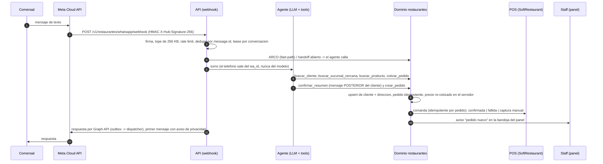
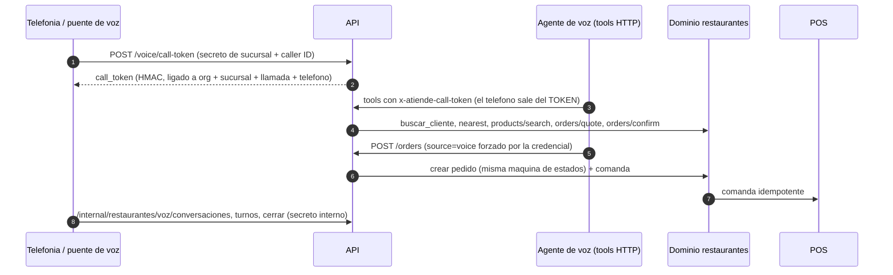
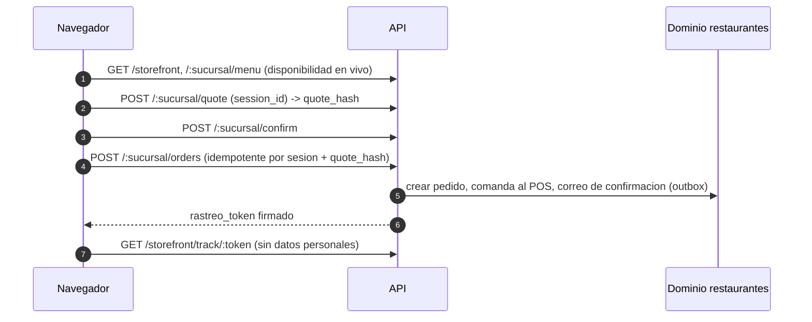

# Ciclo de punta a punta de Restaurantes, por rol (R-34)

Qué ocurre, paso a paso y con qué código, desde que un comensal escribe, llama o entra al sitio hasta que el pedido
queda entregado y cerrado. Cada flujo lo ejecuta de verdad el banco e2e (`apps/api/tests/e2e-ciclo/`, ver
[Cómo se verifica](#como-se-verifica)); lo que NO es real hoy está en [Qué es simulado y qué falta](#que-es-simulado-y-que-falta).

Reglas duras que el servidor aplica en los tres canales (no dependen del prompt): pedido mínimo a domicilio de
$200, alcohol sin domicilio, horario de la sucursal (12:00-01:00 en la cuenta de PM), cobertura de reparto por
zona, "3 de bistec" cotizado como orden de 3, promociones automáticas por día y canal (2x1 del lunes solo para
recoger) y la máquina de estados cotizar -> confirmar -> crear (`agent-tools/order-flow.ts`).

## 1. Comensal por WhatsApp



- **Cliente nuevo**: no existe fila en `restaurantes.customers` hasta el primer pedido; `upsertCustomer` lo crea con
  nombre y teléfono normalizado (10 dígitos) y `addCustomerAddressIfNew` guarda la dirección. El **aviso de
  privacidad y "asistente virtual"** se antepone al primer mensaje de cada teléfono (`claimPrivacyNotice`); los
  derechos ARCO ("mis datos personales") los atiende un fast-path determinista antes del LLM.
- **Cliente existente**: `buscar_cliente` devuelve nombre, direcciones, último pedido y "lo de siempre"; una
  segunda dirección igual no se duplica.
- **Handoff**: cancelaciones, cobros, alergias, quejas, "quiero una persona" y pedidos grandes (más de $4,000 o más de 5 kg;
  más de $2,500 si el número no tiene historial y paga en efectivo: decisión del 2-oct, `PM_PEDIDO_GRANDE_POR_OMISION` en
  `perfil-pm.ts`, editable por organización; regla del prompt de PM) abren una toma de handoff y el agente deja de contestar (`handoffGate`).
- **Replay / carrera**: Meta entrega al menos una vez; el mismo `message.id` no genera segundo turno ni segunda
  respuesta. Un payload solo de estados se acusa 200 sin turno.

## 2. Comensal por llamada (voz)



- El `customer_phone` que escriba el modelo se **ignora**: manda el caller ID del token. Con token, el historial
  solo es el del número que llama.
- La transcripción se redacta (tarjeta/CVV) antes de persistir y el teléfono se guarda solo como hash.
- El proveedor real de voz (Gemini Live) no corre en este repo: el banco usa un guion que invoca las mismas rutas.

## 3. Comensal en el sitio (storefront)



El checkout exige aceptar el aviso de privacidad en la interfaz; el servidor **no** guarda hoy esa aceptación
(ver huecos).

## 4. Cocina

1. El pedido aparece en `GET /v1/restaurantes/:propertyId/admin/orders?status=pending` y la comanda ya está en el
   POS (o en la bandeja de comandas: `.../admin/softrestaurant/comandas`).
2. Si el POS estaba caído, la comanda queda `fallida`/`captura_manual`: el gerente la captura a mano en el POS y la
   marca (`POST .../comandas/:id/capturada`). El dispatcher interno (`/internal/restaurantes/softrestaurant-dispatch`,
   cada 5 min) reintenta las pendientes y no reenvía las capturadas.
3. `PATCH .../admin/orders/:id/status`: `pending -> preparando -> en_camino|listo_para_recoger -> entregado`
   (o `cancelado`/`problema`). Cada transición notifica al comensal por WhatsApp (outbox + dispatcher).
4. **Pedido programado**: queda en `programado` y no va a cocina ni al POS; al faltar 30 min lo promueve el cron
   (`/internal/restaurantes/promover-programados`, 5 min) o el panel al consultar, y en ese momento su comanda se
   encola al POS. Una sucursal desactivada NO promueve sus programados (migración 042 y filtro en el panel): se quedan en
   `programado`, visibles en la lista de programados, para que el equipo los atienda.

## 5. Repartidor

`GET /v1/restaurantes/:propertyId/repartidor/orders` solo lista sus pedidos asignados;
`PATCH .../repartidor/orders/:id/status` solo permite `en_camino`, `entregado` y `problema` (con nota). Un pedido
ajeno responde 404 uniforme. `en_camino` y `entregado` avisan al comensal; `problema` avisa al staff.

## 6. Gerente

- **Bandeja de notificaciones** (`.../admin/order-notifications`, reconocer con `.../:id/acknowledge`): pedido
  nuevo, repartidor asignado, incidencia. Es la bandeja propia de restaurantes (ver huecos sobre `core.notification`).
- Asigna repartidor (`PATCH .../assign-repartidor`), atiende **conversaciones/handoff** y **callbacks** con SLA
  (`.../admin/conversaciones`, `.../admin/callbacks`), y ve las **conversaciones de voz** con su transcripción
  redactada (`.../admin/voz/conversaciones/:id`).

## 7. Dueño

Configura sucursales, catálogo, horario y mínimos (modelo PM), zonas de reparto, promociones, el agente de
WhatsApp (perfil, tono, historial de cambios), la voz por sucursal, el modo de SoftRestaurant (apagado / sombra /
activo) y consulta KPIs, voz y auditoría. El e2e ejercita el efecto de esas reglas, no las pantallas.

## 8. Superadmin y automatizaciones

Los crons del ciclo (`vercel.json`): `/internal/whatsapp/dispatch` (5 min), `/internal/restaurantes/softrestaurant-dispatch`
(5 min), `/internal/restaurantes/promover-programados` (5 min) y `/internal/restaurantes/email-dispatch` (diario).
Los tres primeros reportan latido al panel de salud de superadmin (`withHeartbeat`). Además del cron, el webhook y
las rutas de staff drenan el outbox "inline" para no esperar al siguiente tick.

## Cómo se verifica

`apps/api/tests/e2e-ciclo/` levanta la API real (`buildApp`) en un puerto HTTP efímero con repos en memoria y le
conecta simuladores locales que hablan HTTP de verdad (`@atiende/whatsapp-gateway/testing`):

| Pieza | Qué hace |
|---|---|
| `MetaCloudSimulator` | Meta -> webhook con firma HMAC sobre los bytes exactos; replay; estados; `POST /{v}/{phone_number_id}/messages` con token, botones y la **regla de 24 h** (error 131047 si no es plantilla y la ventana está cerrada); fallos forzados |
| `ResendSink` | Receptor con la forma de `POST /emails` de Resend (es el único transporte de correo del repo, por eso hace el papel de Mailpit): guarda cada correo, respeta `Idempotency-Key`, fallos forzados |
| `createSimulatorFetch` | Redirige `api.resend.com` y `graph.facebook.com` a los simuladores y **bloquea cualquier otro host** |
| `FakeSoftRestaurantAdapter` | POS falso en modo activo (idempotente, fallas inyectables) |
| LLM guionado | `FakeLlmProvider` con un guion de tool calls: el servidor aplica las reglas, el guion solo "se equivoca" a propósito |

Casos: `whatsapp-cliente-nuevo`, `whatsapp-casos` (existente, agotado, fuera de horario, fuera de zona, mínimo,
alcohol, cancelación, pedido grande, replay y carrera de webhook, firma inválida, mensajes fuera de orden, ventana de
24 h vencida), `voz-ciclo`, `storefront-ciclo`, `programado-pos-ciclo`. Corren con el reloj fijo (martes 13:00 de
Mérida) y están en `vitest.clock-guard.config.ts` para probarse bajo varias zonas horarias.

```bash
npx vitest run apps/api/tests/e2e-ciclo --maxWorkers=2
npx vitest run packages/whatsapp-gateway --maxWorkers=2     # los simuladores mismos
```

## Qué es simulado y qué falta

| Tema | Estado hoy |
|---|---|
| Meta, correo, POS, LLM, voz | Simulados en los tests; en producción dependen de credenciales (WHATSAPP_ACCESS_TOKEN, RESEND_API_KEY, SoftRestaurant real, OpenRouter, proveedor de voz) |
| Aviso fuera de la ventana de 24 h (pedidos de voz/web) | **Hueco**: el aviso de estado muere `dead` con 131047 porque `MetaGraphWhatsAppClient` no sabe enviar plantillas HSM (R-27). El e2e lo demuestra |
| Notificación in-app en `core.notification` (campana) | **Hueco**: ningún código de restaurantes escribe ahí todavía; el staff se entera por la bandeja `order-notifications` |
| Staff avisado cuando un programado entra a cocina | **Hueco**: el aviso de "pedido nuevo" se emite al crearlo; un evento nuevo requiere ampliar el CHECK de `event_type` (migración) |
| Consentimiento del checkout web | **Hueco**: la interfaz lo exige, el servidor no lo persiste |
| Postgres real (RLS, GRANT, definer) | No cubierto por este banco: lo cubren los `scripts/verify-restaurantes-*` |
| Pedidos programados por agente (WhatsApp/voz) | **Hueco**: las tools `crear_pedido` de los agentes no tienen `programado_para`; solo lo acepta el checkout público legado (`POST /v1/restaurantes/:orgSlug/orders`, que ya exige las mismas reglas web que el storefront); el menú en línea (`/pedir/...`) rechaza `programado_para` con un 400 explícito porque su interfaz todavía no tiene selector de fecha |
